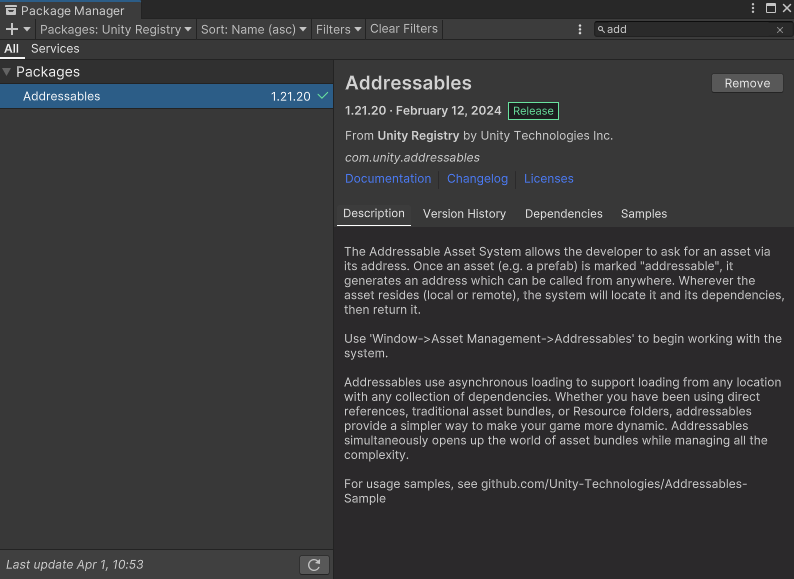
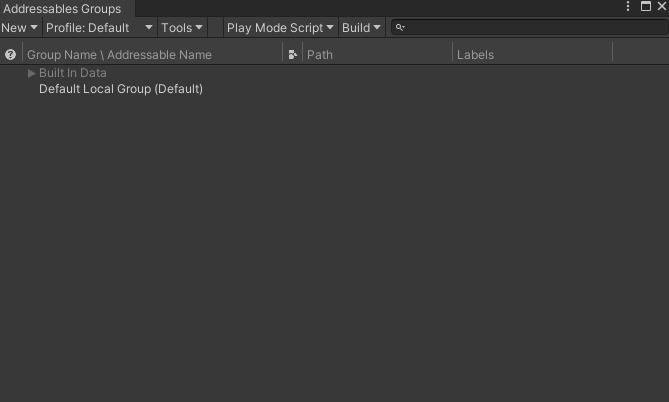
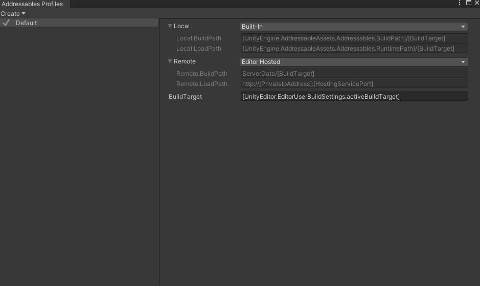
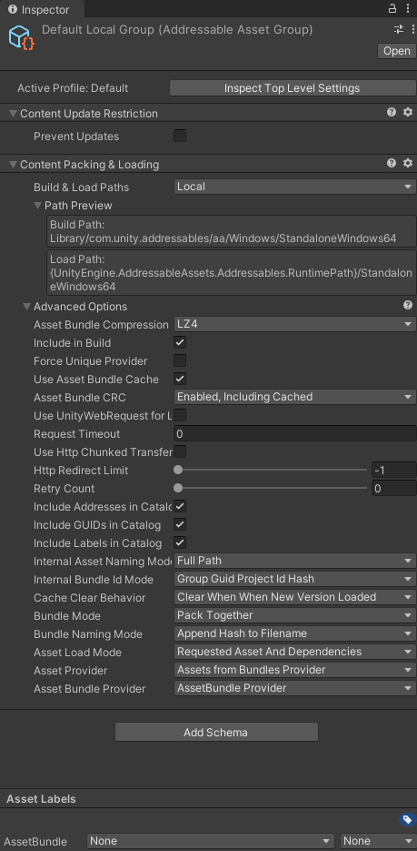
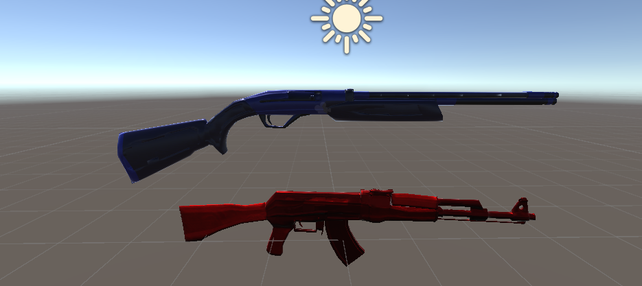
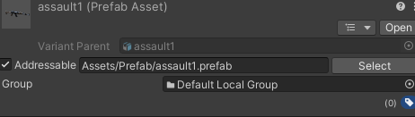
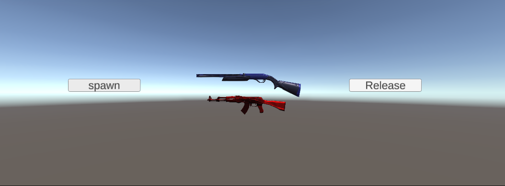
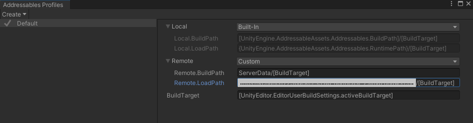

# 유니티 에셋 관리 방법

유니티에서 에셋을 로드하기 위한 세 가지 주요 방법에는 Resource Folder, Asset Bundle, Addressable이 있다. 
<br>
<br>
## Resource Folder 사용

### 개념
- 리소스 폴더는 유니티 프로젝트 내에 있는 특정 폴더로, `Resources.Load()` 메서드를 통해 런타임 시 에셋을 동적으로 로드할 수 있음. ex) Prefab A가 있을 때, `Resources.Load<GameObject>("A")` -> 기존에 만들어 놓은 prefab가 동일한 객체 생성. <br>참고 : <https://learnandcreate.tistory.com/753>

### 장점
- 구현이 간단, 직관적.
- 런타임 시 필요한 에셋 쉽게 로드 가능.
<br>

### 단점
- 빌드 파일 크기 커짐. 
- 사용하지 않는 에셋이 포함될 수 있음.<br><br>
&rightarrow; 빌드 시간이 길어짐. 프로젝트 빌드 시 모든 에셋들은 Serialized Component로 저장되고 Meta Data가 생기는데 따라서 씬에서 사용하지 않는 오브젝트의 Meta Data도 메모리에 올라감. -> 메모리 관리 비효률적.
<br>
<br>
<br>
## Asset Bundles 사용

### 개념
- 에셋 번들은 에셋을 묶어놓은 것. 이를 외부 스토리지 or 클라우드에 로드하고 이후 클라이언트가 다운받아서 사용할 수 있음-> 원본 파일이 아니라 유니티에서 쓸 수 있도록 Serialized한 오브젝트의 헤더 정보만 로드하고 실제 요청이 들어오면 데이터를 로드하는 방식.<br>
참고 :
<https://itmining.tistory.com/54>

### 장점
- 초기 빌드 사이즈를 줄일 수 있음.
- DLC 같은 다운로드 가능한 콘텐츠 추가하기에 용의. -> 수정사항을 다시 빌드 하지 않아도 된다.
<br>

### 단점
- 관리가 복잡하다. -> 저장소로부터 에셋번들과 에셋을 각각 '경로'와 '파일명' string으로 매칭하는데, string 변경 or 오타 시 에러 발생할 수 있음.
- 의존성 문제가 발생할 수 있음. 
<br>
<br>
<br>
## Addressables Asset 사용

### 개념
- Addressables Asset은 주소값을 이용하여 에섯의 관리, 로딩, 빌드 할 수 있는 시스템이다. -> Asset Bundle 업그레이드 버젼으로 편의성이 개선됨. -> Asset Bundle이 경로를 통해 저장소에서 데이터를 직접 가져온 반면,Addressable Asset은 중계자를 통해 가져오는 느낌.<br>
참고: <https://devshovelinglife.tistory.com/398>

### 장점
- Asset Bundle의 장점을 그대로 사용 가능. 
- 관리하기 편함. -> 경로를 매칭하는 과정이 없기 때문에 string을 하나씩 바꾸어 주지 않아도 되고, Addressable 관리창에서 에셋 그룹을 편집할 수 있음.
- 효율적인 에셋 관리 및 메모리 최적화. ->종속성에 의한 중복 번들링을 피할 수 있음.
<br>
### 단점
- Asset Bundle에 비해 처음에 할게 많다.
<br>
<br>
<br>

### 사용법
1. Package Manager에서 Addressables 설치
2. 사용할 에셋의 Addressable 항목 체크, path 주소 설정.
3. Window > Asset Management > Addressable > Groups 을 통해 Asset 관리
#### 서버에 Load, Down
- Window > Asset Management > Addressable > Profiles 에서 RemoteLoadPath 주소 설정.
- addressable doc 참고하여 코드 작성. <Br><br>

#### Using문 선언
```c#
using UnityEngine.AddressableAssets;
using UnityEngine.ResourceManagements.AsyncOperations;
```
#### Asset Download
```c#
public void DownloadDependenciesAsync(object key)
{
    Addressables.GetDownloadSizeAsync(key).Completed += (opSize) =>
    {
        if (opSize.Status == AsyncOperationStatus.Succeeded && opSize.Result >0)
        {
            Addressables.DownloadDependenciesAsync(key, true).Completed += (opDownload)=>
            {
                if(((AsyncOperationHandle)opDownload).Status != AsyncOperationStatus.Succeeded)
                    return; 
                    // 다운로드 완료 처리
            };
        }
        else
        {
            // 이미 다운로드가 완료된 상태 처리.
        }
    }
}
```
<br></br>

#### Asset Load
```c#
public void LoadAssetAsync(object key)
{
    try
    {
        Addressables.LoadAssetAsync<GameObject>(key).Completed += (op) =>
        {
            if(((AsyncOperationHandle<GameObject>)op).Status == AsyncOperationStatus.Succeeded)
                return; // 로드 완료 처리
        };
    }
    catch(Exception e) { Debug.LogError(e.Message); }
}
```
<br></br>

#### Addressable Prefab assign and release
```c#
public AssetReference SpawnablePrefab;

public void CreatePrefab() // Addressable 프리팹 할당
{
    List<AsyncOperationHandle<GameObject>> handles = new List<AsyncOperationHandle<GameObject>>();
    AsyncOperationHandle<GameObject> handle = SpawnablePrefab.InstantiateAsync();
    handles.Add(handle);
}
public void ReleasePrefab() // 번들 해제시 Release 함수를 이용할 수 있다.
{
    foreach(var handle in handles)
    {
        Addressables.Release(handle);
    }
}
```
<br>

#### 알아두면 좋을 특징
- 참고 : <https://blog.naver.com/cdw0424/221764918184>
- 참고 : <https://blog.naver.com/cdw0424/221764918184>

<br>
<br>

### Local에서 실습해보기

1. Window > Package Manager > Package : Unity Registery 의 Addressables 설치하기 <br>


<br>
<br>
2. Window > Asset Management > Addressables > Groups 으로 Addressable Groups 창 열기 (여기서 대부분을 관리함 ) <br>


<br>
<br>
3. Addressable Groups창에서 Addressable Profiles 창 열기 ( 서버를 사용할 때 주소를 입력하는 곳 )<br>


<br>
<br>
4. Addressable Groups에서 개별 그룹 클릭 시, 그룹 별로 Inspector를 관리할 수 있음. <br><br>
**Build & Load Paths** : Remote로 설정
**Cached Clear Behavior** : "Clear When When New Version Loaded" 설정 시, 기존에 만들어져 있는 번들의 변경사항에 대해서 새로운 저장 파일을 만듬.<br><br>


<br>
<br>
5. Inspector 의 Inspect Top Level Settings 클릭 시, 전체 설정 관리 가능.<br><br>
**Unique Bundle IDs** : 빌드 때마다 새로운 에셋 추가에 대해서만 적용해줌.<br>
**Send Profiler Events** : 이벤트 뷰어창을 통해 상태를 확인할 수 있음. <br>
**Build Remote Cataglog** : 카탈로그의 사본을 생성하고 서버를 통해 불러올 수 있음. <br>
**Build & Load Paths** : Remote로 설정.<br><br>


<br>
<br>

6. Addressables을 적용할 프리팹에 Inspector 창에서 Addressable 항목 체크 <br>
: Addressable Group 창에서 추가된 프리팹 확인 가능. material들은 따로 addressable 체크 해주어야 한다. <br>





<br>
<br>

7. C# 스크립트 작성.<br>

```c#
using System.Collections;
using System.Collections.Generic;
using UnityEngine;
using UnityEngine.AddressableAssets;

public class AddressableManager : MonoBehaviour
{
    [SerializeField]
    private AssetReferenceGameObject[] Objs;

    private List<GameObject> gameObjects = new List<GameObject>(); // 불러온 오브젝트를 담을 리스트
    void Start()
    {
        StartCoroutine(InitAddressable());
    }
    IEnumerator InitAddressable()
    {
        var init = Addressables.InitializeAsync();
        yield return init;
    }
    public void BT_spawn() // Spawn
    {
        for(int i = 0; i < Objs.Length; i++)
        {
            Objs[i].InstantiateAsync().Completed += (obj) => // 람다 함수 사용
            {
                gameObjects.Add(obj.Result);
            };
        }
    }
     public void BT_Release()
    {
         if (gameObjects.Count == 0) return;
        var index = gameObjects.Count - 1;
        Addressables.ReleaseInstance(gameObjects[index]);
        gameObjects.RemoveAt(index);
        //만약 오디오나 이미지 파일이 있다면 ~.ReleaseAsset(); 으로 해제가능.
    }
}
```
<br>
<br>

8. Addressables Group에 가서 Build > New Build > Default Build Script 클릭, Play Mode Script -> Use Asset Database 클릭.<br>




<br>
<br>
<br>

### 서버에서 실습해보기
1. AWS의 S3 버킷을 만들고 서버로 사용 할 수 있도록 설정한다. <br>
2. S3 주소 URL를 Addressable Profiles 의 Remote 클릭, Custom 클릭, Remote.LoadPath에 URL 입력한다. <br>



<br>

* Default Local Group과 AddressableAassetSettings의 Build & Load Paths가 Remote로 설정되어 있는지 확인.
<br>
<br>
<br>


3. Addressables Group 창에서 Build > New Build > Default Build Script 실행. (만약 기존에 로컬환경에서 사용한 것이 있다면, Build > Clear Build Cache 후, ServerData/StandaloneWindows64 폴더를 삭제하고 진행 ) <br><br>

4. 새로 만들어진 ServerData/StandaloneWindow64 폴더를 S3에 업로드. <br>


<br>

5. Addressables Group 창에서 Play Mode Script > Use Exiting Build 선택 후 실행.

<br>
<br>

* 이후 플레이 시, C:/User/User/Appdata/LocalLow/Unity/ProjectName 에서 내려받은 파일들을 확인 할 수 있다.

<br>
<br>

* 실습 참고 : <https://www.youtube.com/watch?v=uTSxPPaW2-k>


