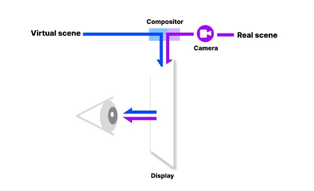

# Pico4 HMD에서 QR 이미지 인식.

### 현재 직면한 문제점
&rightarrow; pico4 에 전면카메라 (passthrough 기능을 위한) 가 내장되어 있음에도 불구하고, 카메라를 통한 이미지 데이터를 얻을 수가 없다. (maybe 사생활 침해 이슈 때문) 
먼저 Pico Unity Integration SDK에서 Pico HMD의 패스쓰루 기능의 구현방식을 설명한 것을 보면,   

Virtual Scene을 제공하는 부분과, Real Scene(패스쓰루 부분)을 제공하는 부분이 나누어져 있고 , 제공되는 SDK에서 두 부분을 합쳐서 보여준다고 되어있다. 즉, 가상환경 레이어와 패스쓰루 레이어를 구분한 뒤, SDK에서 하나의 레이어로 합친다는 뜻 같다.  

또한 SDK에서 제공되는 "PXR_Manager.cs" 의 PXR_Boundary.EnableSeeThroughManual() 을 통해 패스쓰루 기능을 on/off 할 수 있는데, 나머지 기능을 활용 할 수 있는 방법은 따로 언급이 되어 있지 않다.   
Meta community에서 나와 같은 문제에 대한 글을 확인 할 수 있었다.
<https://communityforums.atmeta.com/t5/Talk-VR/Scan-QR-code-with-passthrough-camera/td-p/959717>  
&rightarrow; 요약하자면, 제공되는 API는 없으며 패스쓰루가 런타임에 작용하며 Unity에서 패스쓰루 이미지의 렌더링 여부는 컨트롤 할 수 있지만, 어떠한 이미지인지에 대한 정보는 얻을 수 없다. so, stick a web cam.  

실제 SDk를 뒤져봐도, 해당 카메라에서 받은 데이터를 직접 이용하도록 만들어 놓은 클래스나 함수가 없었다. 함수명을 바탕으로 cs파일들을 살펴보던 중, PXR_plugin.cs에 많은 함수들이 DLLImport를 통해 네이티브 코드를 이용하는 것을 확인하였다. 그 중에서 Camera 관련한 함수들도 꽤 많았지만 .dll 파일을 수정하는건 해본적이 없기 떄문에, 다른 방법을 찾기 시작했다.

그러던 중, 아래의 방법을 생각하게 되었다. SDK에서 제공하는 MRC 기능을 이용하여, 이미지를 캡쳐하고 이를 이용하여 QR을 인식해보자. 

